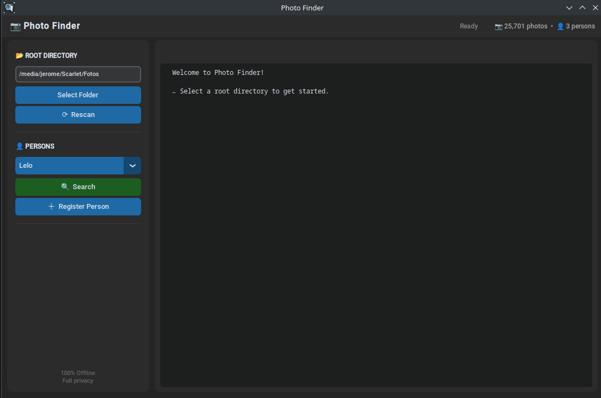
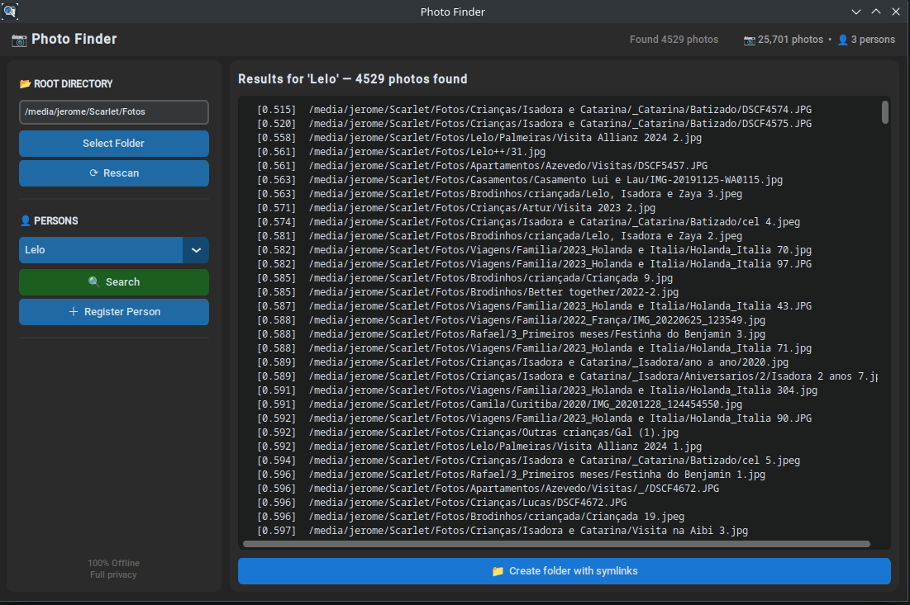

# 📷 Photo Finder

A desktop application for **face recognition in your personal photo collection** — 100% offline, fully private.

Register a person with a single reference photo, then search your entire library to find every photo they appear in. All processing runs locally on your machine using [InsightFace](https://github.com/deepinsight/insightface) (ArcFace model) — no cloud, no API keys, no data ever leaves your computer.

---

## ✨ Features

- 🔍 **Face search** — Find all photos of a person across thousands of images
- 📦 **Smart scan** — Detects new, moved, and deleted photos incrementally
- 😀 **Multi-face detection** — Indexes every face in every photo
- 📁 **Symlink export** — Creates a folder with links to matching photos for easy browsing
- 🚫 **Fully offline** — No internet connection required, ever
- 🖥️ **Modern dark UI** — Built with [CustomTkinter](https://github.com/TomSchimansky/CustomTkinter)
- ⚡ **Multi-threaded scanning** — Uses all available CPU cores
- ❌ **Cancellable scans** — Stop a long scan at any time

---

## 📸 Screenshots




---

## 🚀 Getting Started

### Prerequisites

- Python 3.10+
- A virtual environment is recommended

### Installation

```bash
# Clone the repository
git clone https://github.com/jeromevonk/photo-finder.git
cd photo-finder

# Create and activate a virtual environment
python3 -m venv venv
source venv/bin/activate

# Install dependencies
pip install -r requirements.txt
```

### Running

```bash
source venv/bin/activate
source venv/bin/activate
python src/app_gui.py
```

Or use the provided shell script:

```bash
chmod +x run_photo_finder.sh
./run_photo_finder.sh
```

---

## 🧑‍💻 How It Works

```
┌──────────────┐     ┌──────────────┐     ┌──────────────┐
│ PhotoScanner │───▶│  FaceEngine  │───▶│   Database   │
│              │     │ (InsightFace)│     │   (SQLite)   │
│ Walks dirs   │     │ Detect faces │     │ Store paths  │
│ Detects moves│     │ Extract emb. │     │ Store embeds │
└──────────────┘     └──────────────┘     └──────────────┘
                            │
                            ▼
                     ┌──────────────┐
                     │   Search     │
                     │ Compare emb. │
                     │ Rank by dist.│
                     └──────────────┘
```

1. **Select** a root directory containing your photos
2. **Scan** — the app walks through all `.jpg`, `.jpeg`, `.png` files, detects faces, and stores their embeddings in a local SQLite database
3. **Register** a person by providing a single photo with their face
4. **Search** — compares the registered face against all indexed faces using Euclidean distance on normalized ArcFace embeddings

The app uses a **fingerprint-based move detection** system (file size + modification time) to efficiently handle photos that were reorganized without re-processing them.

### 📏 Understanding Face Distance

The matching is based on the **Euclidean Distance** between face embeddings (512-dimensional vectors).

- **Normalized Vectors**: All embeddings are normalized to unit length, meaning the distance between any two faces will always fall between `0.0` and `2.0`.
- **Match Threshold**: By default, the app uses a threshold of `1.15`.
  - **< 0.8**: Extremely high confidence (often the same person in similar lighting).
  - **0.8 - 1.1**: Strong match (same person, different angles/years).
  - **1.1 - 1.2**: Potential match (may include some false positives).
  - **> 1.2**: Likely different people.

You can fine-tune this in `src/config.py` by adjusting `FACE_DISTANCE_THRESHOLD`.

---

## ⚙️ Configuration

Edit `config.py` to adjust:

| Parameter | Default | Description |
|-----------|---------|-------------|
| `FACE_DISTANCE_THRESHOLD` | `1.15` | Maximum Euclidean distance to consider a match (lower = stricter) |
| `MAX_IMAGE_WIDTH` | `1600` | Images wider than this are resized before face detection |
| `RESIZE_WIDTH` | `1000` | Target width when resizing large images |
| `MAX_WORKERS` | `CPU cores - 1` | Number of threads for parallel scanning |

---

## 📂 Project Structure

```
photo-finder/
├── src/
│   ├── app_gui.py       # Main GUI application
│   ├── config.py        # Configuration & Thresholds
│   ├── database.py      # SQLite layer
│   ├── face_engine.py   # AI Engine (InsightFace)
│   └── scanner.py       # Fast photo indexing
├── database.db          # Your local face index
├── icon.png             # App icon
├── requirements.txt     # Dependencies
└── run_photo_finder.sh  # Launcher script
```

---

## 🪟 Windows Compatibility

While Photo Finder is cross-platform, there is one important note for Windows users regarding the **Symlink Export** feature:

- **Permissions**: By default, Windows restricts the creation of symbolic links to **Administrators**.
- **The Fix**: To create symlinks without running the app as Administrator, you must enable **Developer Mode** in Windows Settings (*Settings > Update & Security > For developers* on Win10, or *Settings > System > For developers* on Win11).
- **Fallback**: If the app lacks permissions to create symlinks, the "Create folder" button will finish without adding the files to the results folder.

---

## 🔒 Privacy

Photo Finder is designed with privacy as a core principle:

- **No network access** — the app never connects to the internet
- **Local database** — all data is stored in a single `database.db` SQLite file
- **No copies** — your photos are never copied; search results use symbolic links
- **Open source** — you can audit every line of code

---

## 📄 License

MIT License — see [LICENSE](LICENSE) for details.